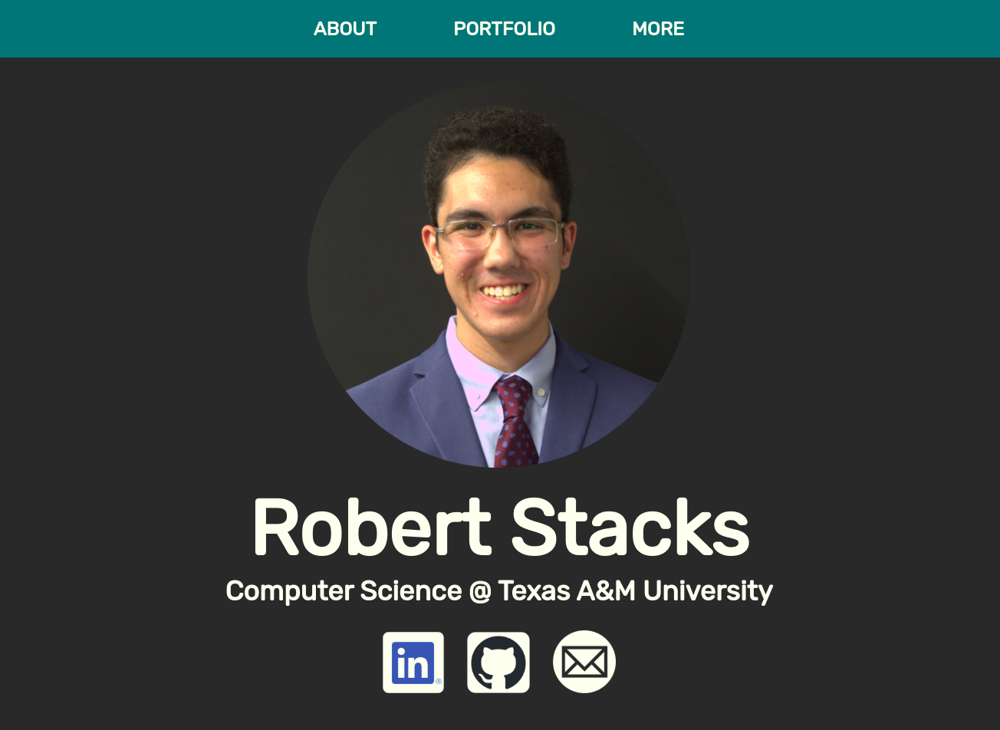

# My Website — robertstacks.com

# 

## Description
This repo contains the source code for my personal homepage and portfolio, built from scratch by me,
Robert Stacks. Feel free to have a look around and explore this repo's history.

## Downloading This Repo
You are free to download the contents of this repo for any purpose. Simply download and extract the ZIP archive for this repo or clone it locally
using the green "Code" button on this repo's homepage.

## Running
My website uses [React](https://react.dev/) and is built using [Vite](https://vitejs.dev/). You will need [Node.js](https://nodejs.org/en) version 20+ in order to run
my website locally.

Once you have downloaded the contents of this repo, navigate to its root directory and run `npm install`. This will automatically install the necessary packages.
From here, you can run `npm run dev` to start a local dev server. You can build my website using `npm run build` and test it locally using `npm run preview`.
